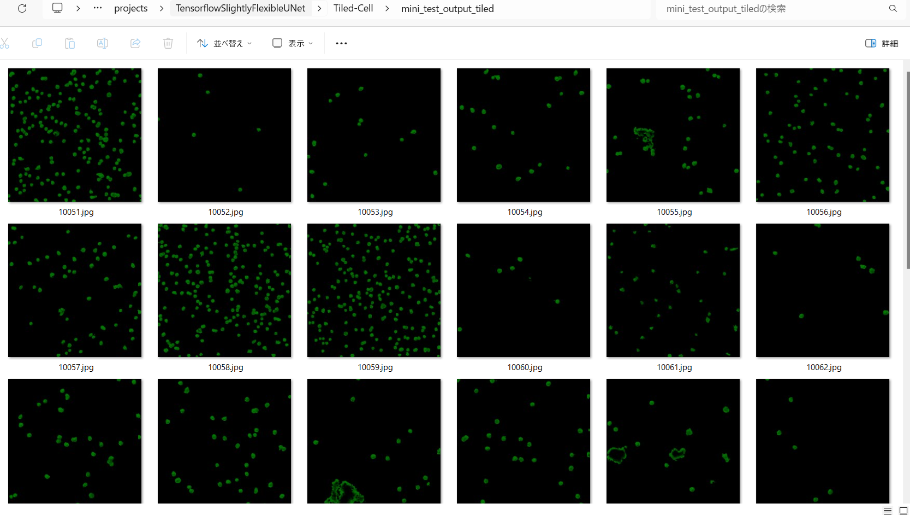

<h2>Tensorflow-Tiled-Image-Segmentation-Augmented-NeurIPS-PNG-Bare-Nuclei (2024/08/17)</h2>

This is the second experiment of Tiled Image Segmentation for <a href="https://zenodo.org/records/10719375">NeurIPS 2022 CellSegmentation</a>
 based on
the <a href="https://github.com/sarah-antillia/Tensorflow-Image-Segmentation-API">Tensorflow-Image-Segmentation-API</a>, and
<a href="https://drive.google.com/file/d/1q1cDVdAqOPRhVegDUKYgxbRqBvVVnqB2/view?usp=sharing">
Tiled-Cell-ImageMask-Dataset-PNG-Bare-Nuclei</a>, which was derived by us from the datset of zenodo.org website: 
<a href="https://zenodo.org/records/10719375">NeurIPS 2022 CellSegmentation</a>
 
 
Please see also the first experiment 
<a href="https://github.com/sarah-antillia/Tensorflow-Tiled-Image-Segmentation-Augmented-NeurIPS-Cell">Tensorflow-Tiled-Image-Segmentation-Augmented-NeurIPS-Cell</a>
  
We generated the Tiled-PNG-Bare-Nuclei dataset from 86 Brightfield Bare Nuclei png image files and corresponding label files in  
<a href="https://zenodo.org/records/10719375/files/Training-labeled.zip?download=1">
<b>Training-labeled</b></a> dataset in <a href="https://zenodo.org/records/10719375">NeurIPS 2022 CellSegmentation</a>
  
 

In this experiment, we employed the following strategy:
<b>
 
1. We trained and validated a TensorFlow UNet model using the Tiled-Cell-ImageMask-Dataset for Bare-Neuclei, 
which was tiledly-splitted to 512x512
 and reduced to 512x512 image and mask dataset. 
2. We applied the Tiled-Image Segmentation inference method to predict the neuclei regions for the mini_test images 
with a resolution of 2K and 4K pixels. 
  
</b>  
Please note that Tiled-Cell-ImageMask contains two types of images and masks: 
1. Tiledly-splitted to 512x512 image and mask files. 
2. Size-reduced to 512x512 image and mask files. 
Namely, this is a mixed set of Tiled and Non-Tiled ImageMask Datasets.

<b>Actual Tiled Image Segmentation for Images of 2090x2090, 2090x2090 and 4096x4096 pixels</b> 
As shown below, the tiled inferred masks look similar to the ground truth masks.
<table>
<tr>
<th>Input: image</th>
<th>Mask (ground_truth)</th>
<th>Prediction: tiled inferred_mask</th>
</tr>
<tr>
<td></td>
<td></td>
<td></td>
</tr>

<tr>
<td></td>
<td></td>
<td></td>
</tr>

<tr>
<td></td>
<td></td>
<td></td>
</tr>

</table>

 
In this experiment, we have used the simple UNet Model 
<a href="./src/TensorflowUNet.py">TensorflowSlightlyFlexibleUNet</a> for this Cell Segmentation Model. 
As shown in <a href="https://github.com/sarah-antillia/Tensorflow-Image-Segmentation-API">Tensorflow-Image-Segmentation-API</a>.
you may try other Tensorflow UNet Models: 

<li><a href="./src/TensorflowSwinUNet.py">TensorflowSwinUNet.py</a></li>
<li><a href="./src/TensorflowMultiResUNet.py">TensorflowMultiResUNet.py</a></li>
<li><a href="./src/TensorflowAttentionUNet.py">TensorflowAttentionUNet.py</a></li>
<li><a href="./src/TensorflowEfficientUNet.py">TensorflowEfficientUNet.py</a></li>
<li><a href="./src/TensorflowUNet3Plus.py">TensorflowUNet3Plus.py</a></li>
<li><a href="./src/TensorflowDeepLabV3Plus.py">TensorflowDeepLabV3Plus.py</a></li>

 

<h3>1. Dataset Citation</h3>
The original dataset used here has been taken from the following website:  

<a href="https://neurips22-cellseg.grand-challenge.org/dataset/"><b>Weakly Supervised Cell Segmentation in Multi-modality 
High-Resolution Miscroscopy Images</b>
</a>
  
<b>Download dataset</b> 
You can download a training dataset corresponding to the cell segmentation from the zendo.org website:  
<a href="https://zenodo.org/records/10719375/files/Training-labeled.zip?download=1">Training-labeled.zip
</a> 
 
<b>NeurIPS 2022 Cell Segmentation Competition Dataset</b> 
Ma, Jun, Xie, Ronald, Ayyadhury, Shamini, Ge, Chen, Gupta, Anubha, Gupta, Ritu, Gu, Song,  
Zhang, Yao, Lee, Gihun, Kim, Joonkee, Lou, Wei, Li, Haofeng, Upschulte, Eric, Dickscheid, Timo, 
de Almeida, José Guilherme, Wang, Yixin, Han, Lin,Yang, Xin, Labagnara, Marco,Gligorovski, Vojislav, 
Scheder, Maxime, Rahi, Sahand Jamal,Kempster, Carly, Pollitt, Alice, Espinosa, Leon, Mignot, Tam, 
Middeke, Jan Moritz, Eckardt, Jan-Niklas, Li, Wangkai, Li, Zhaoyang, Cai, Xiaochen, Bai, Bizhe, 
Greenwald, Noah F., Van Valen, David, Weisbart, Erin, Cimini, Beth A, Cheung, Trevor, Brück, Oscar, 
Bader, Gary D.,Wang, Bo 

Zenodo. https://doi.org/10.5281/zenodo.10719375 
  
<b>Data license</b>: CC BY-NC-ND
 

<h3>
<a id="2">
2 Tiled-Cell ImageMask Dataset
</a>
</h3>
 If you would like to train this Tiled-Cell Segmentation model by yourself,
 please download the dataset from the google drive 
<a href="https://drive.google.com/file/d/1q1cDVdAqOPRhVegDUKYgxbRqBvVVnqB2/view?usp=sharing">
Tiled-Cell-ImageMask-Dataset-PNG-Bare-Nuclei</a>,
 
expand the downloaded ImageMaskDataset and put it under <b>./dataset</b> folder to be
<pre>
./dataset
└─Tiled-Cell
    ├─test
    │   ├─images
    │   └─masks
    ├─train
    │   ├─images
    │   └─masks
    └─valid
        ├─images
        └─masks
</pre>

<b>Tiled-Cell Dataset Statistics</b> 
 
 
As shown above, the number of images of train and valid datasets is not so large to use for a training set for our segmentation model, 
so we used an online augmentation tool <a href="./src/ImageMaskAugmentor.py">ImageMaskAugmentor.py</a> to increase the number of the dataset 
during the training process. 
 

 
<b>Train_images_sample</b> 

 
<b>Train_masks_sample</b> 

 

<h3>
3 Train TensorflowUNet Model
</h3>
 We have trained Tiled-Cell TensorflowUNet Model by using the following
<a href="./projects/TensorflowSlightlyFlexibleUNet/Tiled-Cell/train_eval_infer.config"> <b>train_eval_infer.config</b></a> file.  
Please move to ./projects/Tiled-Cell and run the following bat file. 
<pre>
>1.train.bat
</pre>
, which simply runs the following command. 
<pre>
>python ../../../src/TensorflowUNetTrainer.py ./train_eval_infer.config
</pre>

<pre>
; train_eval_infer.config
; 2024/08/16 (C) antillia.com

[model]
model          = "TensorflowUNet"
generator      = True
image_width    = 512
image_height   = 512
image_channels = 3
input_normalize = False
normalization  = False
num_classes    = 1
base_filters   = 16
base_kernels   = (7,7)
num_layers     = 8
dropout_rate   = 0.05
learning_rate  = 0.0001
clipvalue      = 0.5
dilation       = (1,1)
;loss           = "bce_iou_loss"
loss           = "bce_dice_loss"
metrics        = ["dice_coef"]
show_summary   = False

[train]
epochs        = 100
batch_size    = 2
steps_per_epoch  = 240
validation_steps = 80
patience      = 10

;metrics       = ["iou_coef", "val_iou_coef"]
metrics       = ["dice_coef", "val_dice_coef"]

model_dir     = "./models"
eval_dir      = "./eval"
image_datapath = "../../../dataset/Tiled-Cell/train/images/"
mask_datapath  = "../../../dataset/Tiled-Cell/train/masks/"

epoch_change_infer     = True
epoch_change_infer_dir = "./epoch_change_infer"
epoch_change_tiledinfer     = True
epoch_change_tiledinfer_dir = "./epoch_change_tiledinfer"
num_infer_images       = 1

create_backup  = False

learning_rate_reducer = True
reducer_factor     = 0.3
reducer_patience   = 4
save_weights_only  = True

[eval]
image_datapath = "../../../dataset/Tiled-Cell/valid/images/"
mask_datapath  = "../../../dataset/Tiled-Cell/valid/masks/"

[test] 
image_datapath = "../../../dataset/Tiled-Cell/test/images/"
mask_datapath  = "../../../dataset/Tiled-Cell/test/masks/"

[infer] 
images_dir    = "./mini_test/images"
output_dir    = "./mini_test_output"

[tiledinfer] 
overlapping   = 64
images_dir    = "./mini_test/images"
output_dir    = "./mini_test_output_tiled"

[segmentation]
colorize      = True
black         = "black"
white         = "green"
blursize      = None

[image]
;color_converter = None
color_converter = "cv2.COLOR_BGR2HSV_FULL"
gamma           = 0

[mask]
blur      = False
blur_size = (3,3)
binarize  = False
;threshold = 128
threshold = 80

[generator]
debug        = False
augmentation = True

[augmentor]
vflip    = True
hflip    = True
rotation = True
angles   = [90, 180, 210, 270, ]
shrinks  = [0.8]
shears   = [0.1]

deformation = True
distortion  = True
sharpening  = False
brightening = False
barrdistortion = True

[deformation]
alpah     = 1300
sigmoids  = [8.0,]

[distortion]
gaussian_filter_rsigma= 40
gaussian_filter_sigma = 0.5
distortions           = [0.02,]

[barrdistortion]
radius = 0.3
amount = 0.3
centers =  [(0.3, 0.3), (0.7, 0.3), (0.5, 0.5), (0.3, 0.7), (0.7, 0.7)]

[sharpening]
k        = 1.0

[brightening]
alpha  = 1.2
beta   = 10  
</pre>

<b>Model parameters</b> 
Defined small <b>base_filters</b> and large <b>base_kernels</b> for the first Conv Layer of Encoder Block of 
<a href="./src/TensorflowUNet.py">TensorflowUNet.py</a> 
and large num_layers (including a bridge between Encoder and Decoder Blocks).
<pre>
[model]
base_filters   = 16 
base_kernels   = (7,7)
num_layers     = 8
</pre>

<b>Learning rate</b> 
Defined a small learning rate.  
<pre>
[model]
learning_rate   = 0.0001
</pre>

<b>Online augmentation</b> 
Enabled our online augmentation.  
<pre>
[model]
model         = "TensorflowUNet"
generator     = True
</pre>

<b>Loss and metrics functions</b> 
Specified "bce_dice_loss" and "dice_coef". 
<pre>
[model]
loss           = "bce_dice_loss"
metrics        = ["dice_coef"]
</pre>
<b>Learning rate reducer callback</b> 
Enabled learing_rate_reducer callback, and a small reducer_patience.
<pre> 
[train]
learning_rate_reducer = True
reducer_factor     = 0.3
reducer_patience   = 4
</pre>
<b>Early stopping callback</b> 
Enabled early stopping callback with patience parameter.
<pre>
[train]
patience      = 10
</pre>

<b>Epoch change inference callbacks</b> 
Enabled epoch_change_infer and epoch_change_tiledinfer callbacks. 
<pre>
[train]
epoch_change_infer       = True
epoch_change_infer_dir   =  "./epoch_change_infer"
epoch_change_tiledinfer  = True
epoch_change_tiledinfer_dir = "./epoch_change_tiledinfer"
num_infer_images         = 1
</pre>

By using these callbacks, on every epoch_change, the inference procedures can be called
 for an image in <b>mini_test</b> folder. These will help you confirm how the predicted mask changes 
 at each epoch during your training process.    

<b>Epoch_change_inference output</b> 
 
 
 
<b>Epoch_change_tiled_inference output</b> 
 
 
 
In this experiment, the training process was stopped at epoch 28 by EarlyStopping Callback.  
 
 

 
<a href="./projects/TensorflowSlightlyFlexibleUNet/Tiled-Cell/eval/train_metrics.csv">train_metrics.csv</a> 
 

 
<a href="./projects/TensorflowSlightlyFlexibleUNet/Tiled-Cell/eval/train_losses.csv">train_losses.csv</a> 
 

 

<h3>
4 Evaluation
</h3>
Please move to a <b>./projects/TensorflowSlightlyFlexibleUNet/Tiled-Cell</b> folder, 
and run the following bat file to evaluate TensorflowUNet model for Tiled-Cell. 
<pre>
./2.evaluate.bat
</pre>
This bat file simply runs the following command.
<pre>
python ../../../src/TensorflowUNetEvaluator.py ./train_eval_infer_aug.config
</pre>

Evaluation console output: 

  

<a href="./projects/TensorflowSlightlyFlexibleUNet/Tiled-Cell/evaluation.csv">evaluation.csv</a> 

The loss (bce_dice_loss) score to this <a href="./projects/dataset/Tiled-Cell/test/">Tiled-Cell/test</a> was relatively low, but dice_coef not so high.
<pre>
loss,0.1136
dice_coef,0.8121
</pre>

<h3>
5 Inference
</h3>
Please move to a <b>./projects/TensorflowSlightlyFlexibleUNet/Tiled-Cell</b> folder 
,and run the following bat file to infer segmentation regions for images by the Trained-TensorflowUNet model for Tiled-Cell. 
<pre>
./3.infer.bat
</pre>
This simply runs the following command.
<pre>
python ../../../src/TensorflowUNetInferencer.py ./train_eval_infer_aug.config
</pre>

<b>mini_test_images</b> 
 
<b>mini_test_mask(ground_truth)</b> 
 

<b>Inferred test masks</b> 
 
 

<h3>
6 Tiled Inference
</h3>
Please move to a <b>./projects/TensorflowSlightlyFlexibleUNet/Tiled-Cell</b> folder 
,and run the following bat file to infer segmentation regions for images by the Trained-TensorflowUNet model for Tiled-Cell. 
<pre>
./4.tiled_infer.bat
</pre>
This simply runs the following command.
<pre>
python ../../../src/TensorflowUNetTiledInferencer.py ./train_eval_infer_aug.config
</pre>

<b>Tiled inferred test masks</b> 
 
 
<b>Enlarged images and masks </b> 

<table>
<tr>
<th>Image</th>
<th>Mask (ground_truth)</th>
<th>Tiled-inferred-mask</th>
</tr>

<tr>
<td></td>
<td></td>
<td></td>
</tr>

<tr>
<td></td>
<td></td>
<td></td>
</tr>

<tr>
<td></td>
<td></td>
<td></td>
</tr>

<tr>
<td></td>
<td></td>
<td></td>
</tr>
<tr>
<td></td>
<td></td>
<td></td>
</tr>
</table>

 
 
<!--
  -->
<b>Comparison of Non-tiled inferred mask and Tiled-Inferred mask</b> 
As shown below, the tiled inferencer based on our simple UNet model can generate far better results than non-tiled inferencer.
 
<table>
<tr>
<th>Mask (ground_truth)</th>

<th>Non-tiled-inferred-mask</th>
<th>Tiled-inferred-mask</th>
</tr>
<tr>
<td></td>

<td></td>
<td></td>

</tr>
<tr>
<td></td>

<td></td>
<td></td>
</tr>
<tr>
<td></td>

<td></td>
<td></td>
</tr>
</table>
 

<h3>
References
</h3>
<b>1. Multi-stream Cell Segmentation with Low-level Cues for Multi-modality Images</b> 
Wei Lou, Xinyi Yu, Chenyu Liu , Xiang Wan, Guanbin Li, Siqi Liu, Haofeng Li 
<a href="https://arxiv.org/pdf/2310.14226">https://arxiv.org/pdf/2310.14226</a>
 
 

<b>2. MEDIAR: Harmony of Data-Centric and Model-Centric for Multi-Modality Microscopy
</b> 
Lee-Gihun  
<a href="https://github.com/Lee-Gihun/MEDIAR">https://github.com/Lee-Gihun/MEDIAR</a>
 
 
<b>3. NeurIPS-CellSeg
</b> 
JunMa11  
<a href="https://github.com/JunMa11/NeurIPS-CellSeg">https://github.com/JunMa11/NeurIPS-CellSeg</a>
 

 
<b>4. Tensorflow-Tiled-Image-Segmentation-Augmented-NeurIPS-Cell
</b> 
Toshiyuki Arai @antillia.com 
<a href="https://github.com/sarah-antillia/Tensorflow-Tiled-Image-Segmentation-Augmented-NeurIPS-Cell">
https://github.com/sarah-antillia/Tensorflow-Tiled-Image-Segmentation-Augmented-NeurIPS-Cell</a>
 
